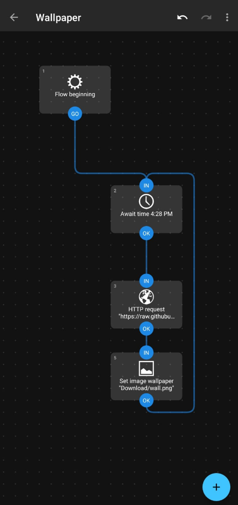
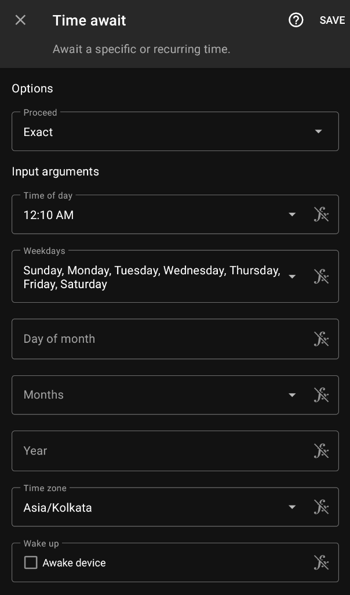
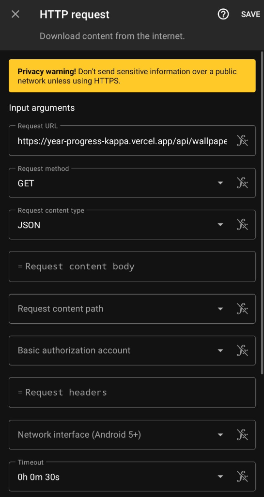
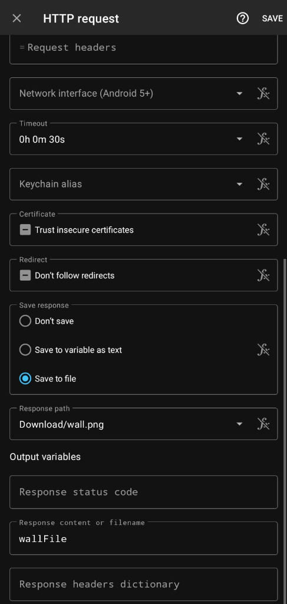
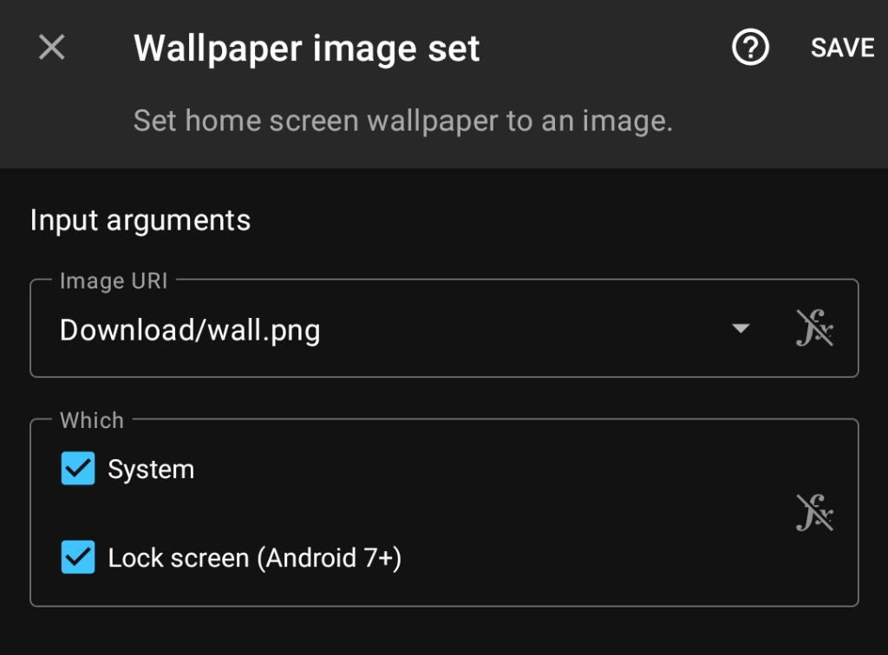

# ⏳ Rings of Time

> A deeply stoic, dynamically generated wallpaper tracking the passage of time.

  

**🌐 [Visit the Live Website & Get Your URL](https://year-progress-kappa.vercel.app)**

---

## 🎨 Anatomy of the Design

Rings of Time isn't just a clock—it's a philosophical dashboard designed perfectly for your phone's lock screen. Every single visual element is mathematically calculated based on the exact day of the year.

* **The Stride Word (Top)**: A daily motivational anchor word chosen from a curated list of stoic concepts (e.g., RELENTLESS, ENDURE, DISCIPLINE).
* **The Chrono-Tracker**: Displays the exact date, the day of the week, exactly how many days are left in the year, and the percentage of the year completed.
* **The Rings of Months (Center)**: 12 concentric rings representing the months of the year. Passed months are solid white. The current month is a vibrant purple-to-orange gradient that slowly fills up its ring as the days pass. Future months remain dim.
* **The 52 Weeks**: The tiny orbital dots surrounding the outermost ring represent the 52 weeks of the year. They light up one by one as the weeks pass.
* **The Stoic Quote (Bottom)**: A daily grounding quote from historical philosophers like Marcus Aurelius, Seneca, and Plato.

---

## ⚡ How it Works (Under the Hood)
This project is powered by a **Serverless Node.js API** hosted on [Vercel](https://vercel.com).

There are no static images saved in this repository. Whenever your phone makes a request to the Vercel API endpoint, Vercel instantly spins up a micro-server, calculates the exact time, mathematically draws the canvas in memory using the `canvas` library, and beams a high-resolution PNG image directly to your device. 

It is a 100% dynamic, on-the-fly generation pipeline.

---

## 📱 How to Automate (Android Setup)

You can turn this API into a live wallpaper that refreshes automatically every single morning using the free Automate app. Here is the exact step-by-step process:

1. **Download the App**: Install **Automate** by LlamaLab from the Google Play Store.
2. **Create a Flow**: Open the app and click the **`+`** icon at the bottom to create a new flow. 
3. **Name it**: Tap on "Untitled" at the top and name it "Wallpaper".
4. **Enter Edit Mode**: Tap the **Pencil icon** at the bottom, then tap the **Connections icon** (the lines/nodes icon).
5. **Add Blocks**: Tap the **`+`** icon and search for these 3 blocks to add them to your board:
   * `Await time`
   * `HTTP request`
   * `Set image wallpaper`
6. **Connect Them**: Drag the connection dots to join the blocks exactly as shown in the diagram below (making sure to create the infinite loop from the last block back to the time block!).

  

### Configure the Blocks:

**Block 1: Await time**
* Tap on the block to edit it.
* **Time of day**: Set to `12:10 AM` (if your app uses 12hr time) OR `00:10` (if your app uses 24hr time).
* **Weekdays**: Make sure to check/select **every single day of the week** so it runs daily!

**Block 2: HTTP request**
* **Method**: `GET`
* **Request URL**: Paste the Universal URL you copied from your website here.
* **Request content type**: `JSON`

* **Save response in**: `Save to file`
* **Save response path**: Tap this, select the `Download` folder (or any folder you prefer), and type the filename as `wall.png` (make sure to include `.png`), then click OK.

**Block 3: Set image wallpaper**
* **Image URI**: First, tap the **`fx`** symbol to enable text input. Inside the double quotes, type the exact same path from the previous step (e.g., `"Download/wall.png"`).
* **Options**: Make sure to check/tick both **System** and **Lock screen** at the bottom so the wallpaper applies everywhere.

Save the Flow, click **Start**, and enjoy your automated stoic wallpaper!
